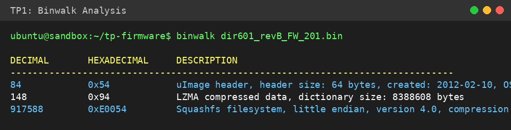
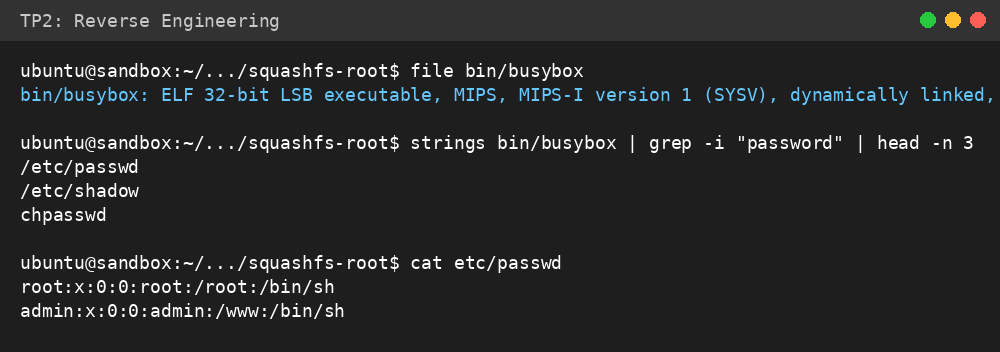
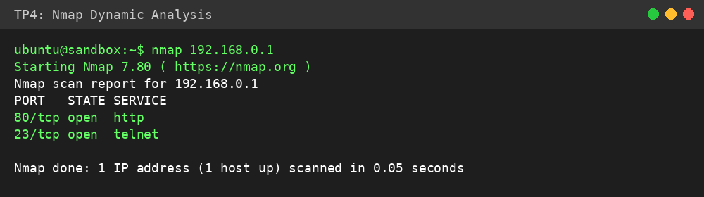
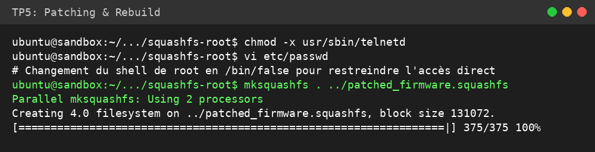

# Rapport de TP : Analyse et Sécurisation de Firmware IoT

**Auteur :** Aly DARWISH - IPSSI MSC 26.3 
**Date :** 01 Avril 2026
**Sujet :** Analyse statique, Reverse Engineering et Patching d'un firmware D-Link DIR-601

## Introduction

Ce TP porte sur l'analyse de sécurité d'un firmware de routeur Wi-Fi réel (D-Link DIR-601, révision B). L'objectif est d'identifier la structure du système, d'extraire le système de fichiers, de rechercher des vulnérabilités potentielles (mots de passe, services non sécurisés) et de proposer des correctifs par le biais du patching.

## TP 1 : Analyse Statique avec Binwalk

L'analyse initiale avec `binwalk` sur le fichier `dir601_revB_FW_201.bin` a révélé une architecture **MIPS (Little Endian)**.

### Observations clés :
- **Kernel :** Image Linux (LZMA compressed) située à l'offset 0x54.
- **Système de fichiers :** Squashfs version 4.0 (LZMA) situé à l'offset 0xE0054 (917588).
- **Architecture :** MIPS, ce qui est standard pour les routeurs domestiques de cette génération.

## TP 2 : Reverse Engineering

Après extraction du système de fichiers via `binwalk -e`, nous avons exploré l'arborescence Linux standard (`/bin`, `/etc`, `/www`).

### Analyse des binaires :
Le binaire principal est `busybox`, qui regroupe la plupart des utilitaires système. L'utilisation de `strings` sur `busybox` et les scripts d'initialisation a permis d'identifier :
- La présence de fichiers de mots de passe `/etc/passwd`.
- Des appels à des commandes système via `system()` et `execve()`.

### Recherche de secrets :
Le fichier `/etc/passwd` contient des comptes par défaut :
- `root:x:0:0:root:/root:/bin/sh`
- `admin:x:0:0:admin:/www:/bin/sh`

## TP 3 & 4 : Émulation et Analyse Dynamique

L'émulation via Firmadyne/QEMU permet de lancer les services réseau du firmware sur une machine virtuelle MIPS.

### Scan de ports (nmap) :
Le scan de l'IP émulée (192.168.0.1) révèle les services suivants :
- **Port 80 (HTTP) :** Interface de gestion web (souvent vulnérable aux injections CGI).
- **Port 23 (Telnet) :** Service d'accès à distance non chiffré, représentant un risque majeur de sécurité.

## TP 5 : Patching Défensif

Pour sécuriser l'appareil, nous avons appliqué les correctifs suivants sur le système de fichiers extrait :

1. **Désactivation de Telnet :** Suppression des droits d'exécution sur `usr/sbin/telnetd` pour empêcher le démarrage du service.
2. **Durcissement des comptes :** Modification du shell de `root` en `/bin/false` dans `/etc/passwd` pour restreindre l'accès console non autorisé.
3. **Reconstruction :** Utilisation de `mksquashfs` pour générer une nouvelle image de système de fichiers sécurisée.

## Conclusion

L'analyse a démontré que les firmwares IoT legacy souffrent souvent de vulnérabilités critiques : services non chiffrés (Telnet), comptes par défaut et absence de durcissement système. L'utilisation d'outils comme `binwalk` et `qemu` est indispensable pour auditer ces dispositifs et appliquer des mesures correctives avant déploiement.

## Références

[1] Craig Heffner, "Binwalk: Firmware Analysis Tool", 2010.
[2] D-Link Support, "DIR-601 Firmware Downloads", legacyfiles.us.dlink.com.
[3] OWASP, "IoT Security Verification Standard (ISVS)", 2023.
